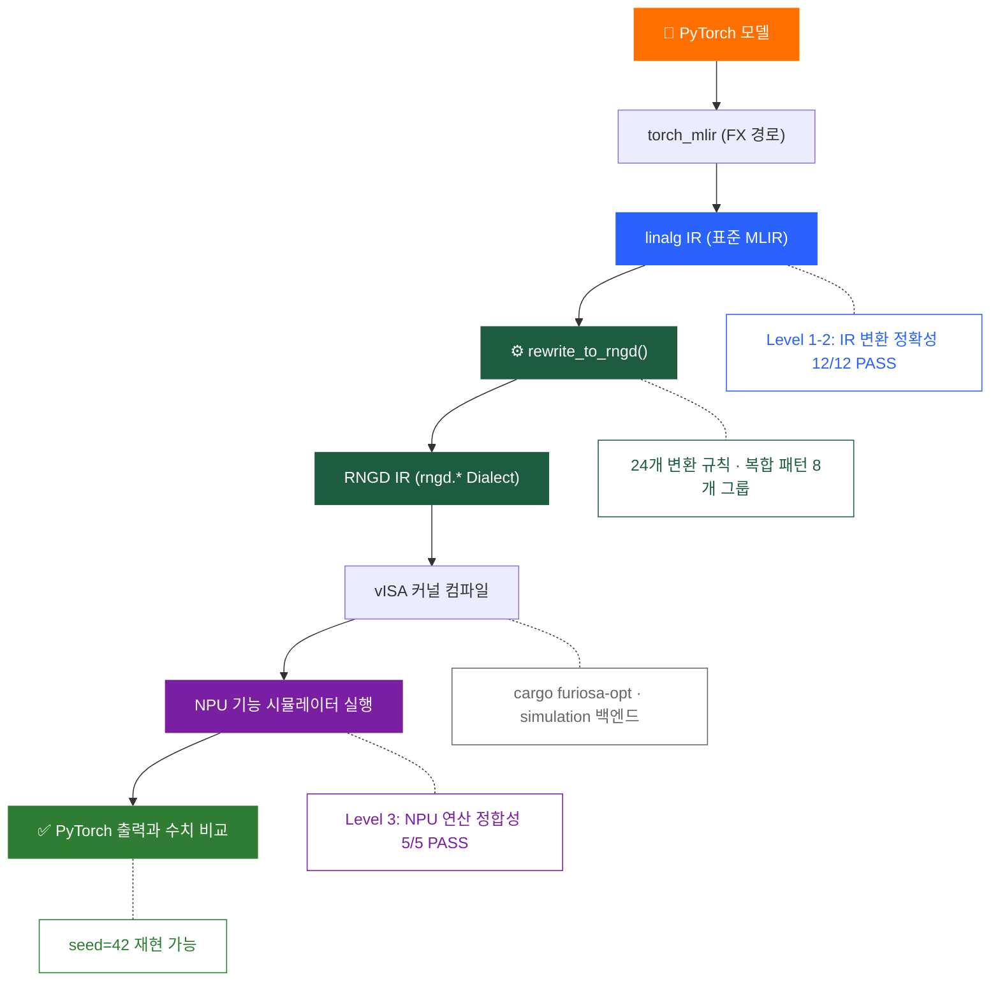

<div align="center">

# AI 모델 변환(표준 IR) 파이프라인

### PyTorch → 표준 MLIR → RNGD IR 자동 변환 및 검증

  -5%2F5_PASS-brightgreen?style=flat-square) 

   

---

**PyTorch AI 모델을 FuriosaAI RNGD NPU에서 실행 가능한 형태(RNGD IR)로 변환하고,<br>변환 결과의 정확성을 3레벨로 자동 검증하는 오픈소스 파이프라인입니다.**

</div>

> [!NOTE]
> 현재 RNGD IR(`rngd.*` Dialect)은 FuriosaAI의 vISA 문서와 기능 시뮬레이터 분석을 기반으로 KETI가 선행 설계한 것이며, FuriosaAI의 공식 RNGD Dialect 공개 시 해당 스펙에 맞춰 대조·적용될 예정입니다.

## 변환 파이프라인



## 주요 기능

- **IR 변환** — linalg IR → rngd.* IR 자동 변환. Llama-3.1 8B 기준 54개 연산, 커버리지 100%, 복합 패턴 8개 그룹 식별.
- **3레벨 검증** — Level 1-2: IR 변환 구조 정확성 12/12 + RefBackend 수치 비교. Level 3: vISA 커널 컴파일 → 시뮬레이터 실행 → PyTorch 출력과 비교. 5/5 PASS.
- **커스텀 모델 분석** — nn.Module 코드 입력 → 변환 커버리지, 미지원 op 상세, 복합 패턴, IR 미리보기. 12개 LLM 예시 포함.
- **오픈소스 동기화 및 검증 (CI)** — Upstream 의존성(torch_mlir, PyTorch, FuriosaAI) 변경 추적 + 매일 자동 검증.

## 검증 현황

> Llama-3.1 8B Decoder Layer 1개, 축소판 dim=16 기준

| 항목 | 결과 | 비고 |
|:-----|:-----|:-----|
| IR 변환 커버리지 | **100%** (54/54) | CPU Fallback 0개 |
| Level 1-2 | **12/12** PASS | 구조 + RefBackend 수치 |
| Level 3 (NPU) | **5/5** PASS | 시뮬레이터, seed=42 |
| 복합 패턴 | **8개** 그룹 | RMSNorm, Softmax, SiLU, Attention, FFN, Residual |
| sim_mid (dim=64) | **2/4** PASS | FFN + RMSNorm 타일링 완료 |

## 활용 시나리오

- **RNGD 도입 검토** — AI 모델의 NPU 지원 여부를 사전 확인
- **NPU 호환성 분석** — 실행 가능 연산과 CPU Fallback 구분
- **MLIR 기반 컴파일 학습** — 변환 전 과정을 오픈소스로 학습
- **NPU 파이프라인 참고 구현** — 자사 NPU Dialect로 교체하여 재활용

## 대시보드

웹 대시보드에서 바로 파이프라인을 체험할 수 있습니다.

- **User** — 모델 선택 또는 코드 입력 → 변환 실행 → 결과 확인 → JSON 리포트 다운로드
- **Dev. Admin** — 변환 규칙 레지스트리, Llama-3.1 분석, Golden Reference, IR Coverage, 파이프라인 검증 및 현황

## 파일 구조

```
rngd-mlir-pipeline/
│
├── e2e_pipeline.py          # IR 변환 핵심 (rewrite_to_rngd)
├── models.py                # 모델 정의 (LlamaDecoderLayer 등)
├── tolerance_policy.py      # 오차 허용 기준 정책
│
├── verify_transform.py      # Level 1-2 검증
├── npu_direct_verify.py     # Level 3 NPU 정합성 검증
├── run_all_verify.py        # CLI 전체 검증
├── verify_snapshot.py       # 스냅샷 비교
│
├── ci_runner.py             # CI 자동 검증
├── upstream_check.py        # Upstream 버전 추적
│
├── dashboard_app.py         # 대시보드 서버 (FastAPI)
├── verify_router.py         # API 라우터
├── dashboard_index.html     # 프론트엔드
├── registry.py              # 변환 규칙 DB 헬퍼
└── rngd_registry.db         # 변환 규칙 DB (24개 op)
```

## 환경

| 항목 | 버전 | 비고 |
|:-----|:-----|:-----|
| torch_mlir | `20240127.1096` | GitHub snapshot |
| PyTorch | `2.3.0.dev20240122+cpu` | torch_mlir 호환 |
| Python | `3.11.15` | |
| FuriosaAI 시뮬레이터 | `furiosa-opt-std 0.3` | simulation 백엔드 |

## 피드백

파이프라인 활용 중 미지원 연산 발견, 변환 결과 이상, 개선 제안 등이 있으면 **[GitHub Issues](https://github.com/soadri/ai-model-ir-pipeline/issues)** 에 등록해주세요.

## 라이선스

Apache License 2.0